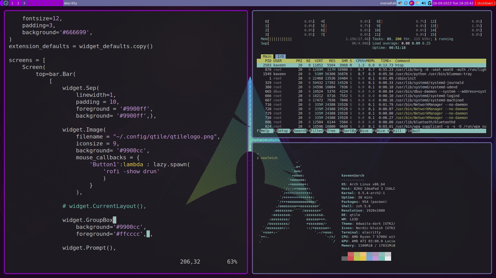

# KLinux Install Script

## Table of content
- [About](About)
- [Screenshot](Screenshot)
- [Requirements](Requirements)
- [Installation](Installation)

> [!WARNING]
> This script is still under development.
> If something crashed while running this script, I don't get responsibility for that.

## About
- This is my project to create an arch-based Linux distro, so I don't have to configure my arch Linux installation every time I re-install it.
- In this setup, I use Qtile as my window manager.
- The reason for that is I like to use `Python` over languages like `lua` or `Haskel`.
- You can find the config files I used in this project [here](https://github.com/kaveen-lakmuthu/qtile).

 ## Screenshot
 

 ## Requirements
 - In order to install this script you need following programmes installed in your syste.
  - ```
    Basic Arch linux System with networkmanager and xserver.
    ```

 ## Installation
 - You can install my configuration on Arch based systems using `install.sh`script.
 - This script first installs the required packages using the pacman package manager and then proceeds to clone the [Qtile config](https://github.com/kaveen-lakmuthu/qtile) repository.
 - Then execute the script,
   - ```
      chmod +x install.sh
     ```
 - Then you can run it using,
   - ```
       ./install.sh
     ```
 - Make sure to run the script with elevated privileges using `sudo` as some of the packages and the service activation require administrative permissions.
 - And then start the `xsession`.
 - Enjoy.
